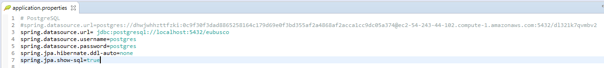

# Eu Busco Web - Sistema de gestão de entregas

Este projeto foi desenvolvido com Spring Boot para ser o servidor RestFULL do sistema Eu Busco, o projeto web do sistema está no repositório [@lmoreira256/eu-busco-web](https://github.com/lmoreira256/eu-busco-web).

## Ver projeto

O projeto pode ser visualizado através do [link](http://eubuscoweb.s3-website-sa-east-1.amazonaws.com) que está hospedado no Amazon S3.
<br>
Usuário: admin
<br>
Senha: 123456

_Obs.: Pode demorar um pouco para startar o servidor após algum tempo parado_.

## Como subir o projeto

Após clonar basta abrir em uma ide que tenha suporte para Spring Boot, durante o desenvolvimento foi utilizado o Spring Tool Suite 4.

## Configurações básicas

Para alterar a base de dados que será utilizada basta alterar no arquivo application.properties:


## Versões utilizadas no projeto
```
java version "1.8.0_251"
Java(TM) SE Runtime Environment (build 1.8.0_251-b08)
Java HotSpot(TM) 64-Bit Server VM (build 25.251-b08, mixed mode)
```

## Considerações finais
O projeto está disponível para alterações, qualquer sugestão ou alteração será muito bem-vinda.
